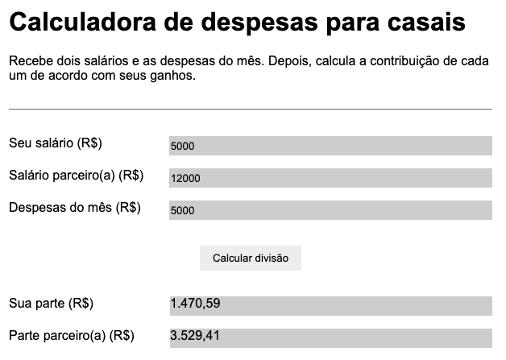
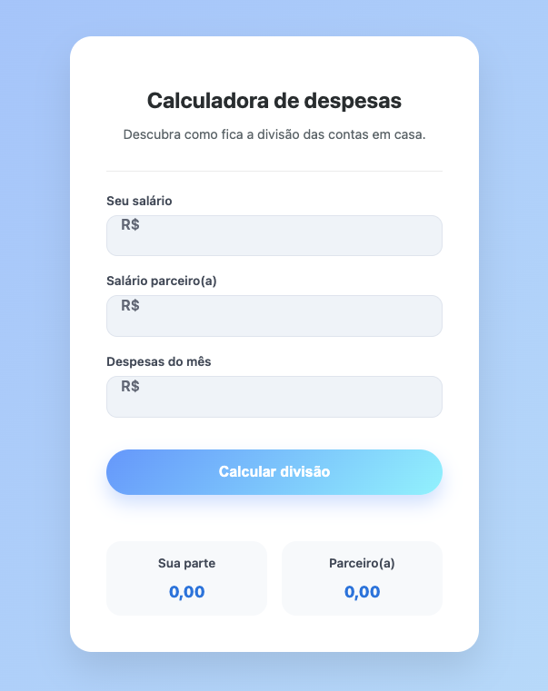

# Calculadora de despesas para casais

Aplicação simples para dividir despesas mensais de forma proporcional à renda de cada pessoa.

## Como funciona
1. O usuário informa os dois salários
2. Informa o total de despesas do mês
3. O sistema calcula a proporção de cada salário em relação à renda total
4. As despesas são divididas proporcionalmente

## Tecnologias
- HTML
- CSS
- JavaScript (vanilla, sem frameworks)

## Aprendizados
- Manipulação do DOM
- Funções puras
- Retorno de objetos
- Formatação de valores monetários com `toLocaleString`
- Separação de responsabilidades (lógica × apresentação)
- Validação básica de inputs

## Como testar
Acesse: https://leeo-pereira.github.io/calculadora-despesas/

## Versionamento

A primeira versão deste app era bem rudimentar. A ideia era entender a lógica e fazer com que tudo estivesse funcionando.

Com tudo funcionando, pedi ao Gemini que criasse uma interface moderna para o app. Descrevi as funcionalidades e campos, e dei referências visuais.

Este foi o resultado:

Pedi então que o Gemini informasse os specs e parti para minha versão final.

Ficou assim:

Na versão final, o "R$" dos `inputs` é adicionado no CSS por meio de pseudo-elemento.

Já o "R$" dos `outputs` é adicionado dinamicamente pelo JavaScript com `toLocaleString`, que define a localização, o estilo (moeda) e o tipo de moeda (real brasileiro).

Por fim, também incluí um alerta caso o usuário deixe algum campo vazio.
